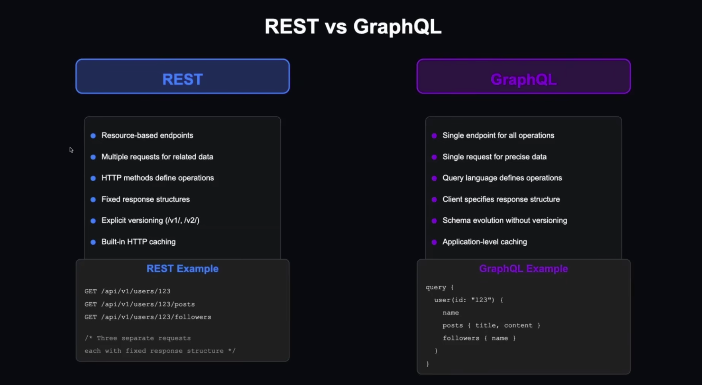
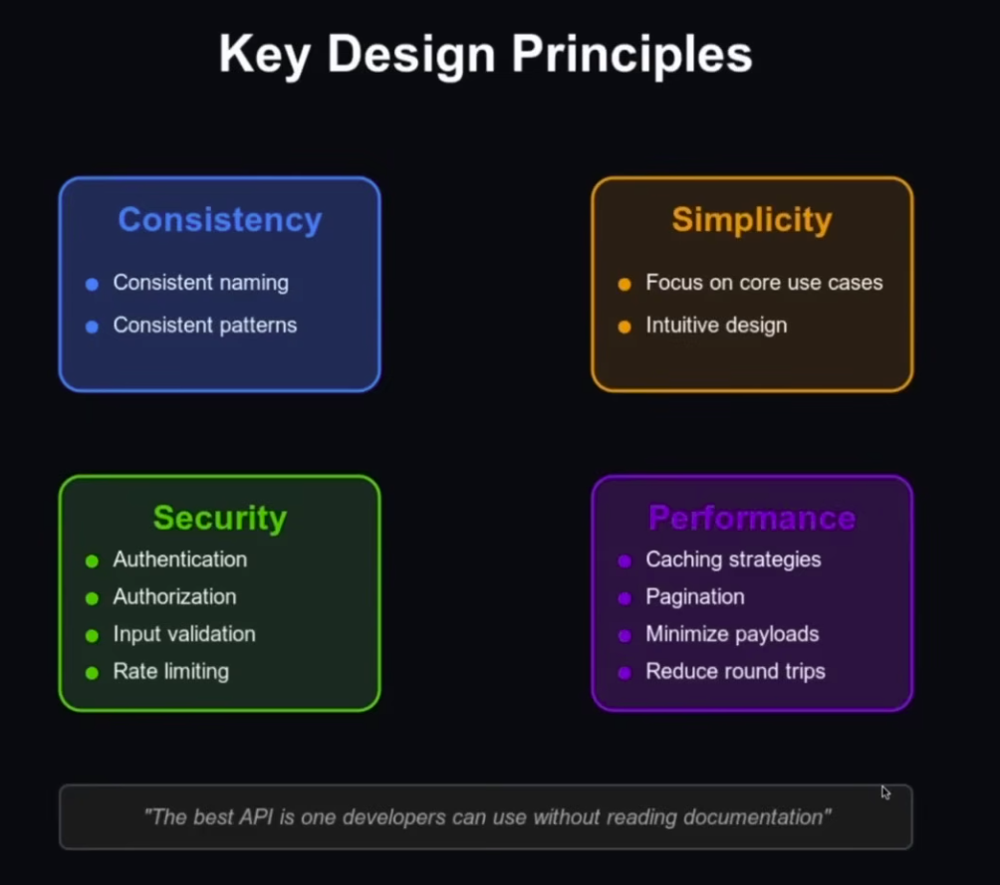
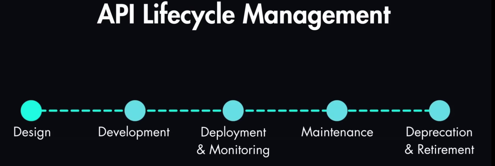

# Node.js :

### :

#### prérequis :

#### Process:

##### multitache :

Le multi taches c'est quand un système utilises plusieurs Threads CPU pour executer des taches en parallèle (en meme temps).

##### illusion multitache :

C'est le cas de Node.js, il donne l'impression de faire du multitache mais techniquement node.js utilise un seul Thread pour executer toutes ces taches. Donc il ne fait pas plusieurs taches en meme temps mais il change très vite de tache
grace AUX Event loop, Callbacks/Promises, Asynchrone non bloquant.

#### Workers Threads:

#### Processus multiples (cluster / PM2)

##### :

##### :

#### Règles & Use cases :

1. Asynchrone ne veut pas dire Parallèle

### API (Apllication Programming Interface) :

#### Definiton :

elle définit comment les composants d'un logiciel devraient interagir entr eux. c'est un contrat qui definit :

- quelle requete pourrait etre faite.
- comment faire cette requete.
- à quelle reponse s'attendre.

#### Les styles d'une API :

##### REST :

- Resource-based : organiseé autour des ressources utilisant le smethodes HTTP
- Stateless: Chaque requête HTTP doit contenir toutes les infos nécessaires pour être traitée. ça contribue au scale out.
- multi endpoints : plusieurs appels à passer, chaque requete a son propre URL. 
- Standerdiezed methods : GET, POST, PUT , DELETE, PATCH , etc..

  => le style le plus utlisé, et utilisé principalment en Web et Mobile apps.

##### GraphQL :

- Query language : les clients font une requete de ce dont ils ont exactement besoin.
- single EndPoint  : toutes les requetes passent par un seul URL exemple: (POST /graphql
), dans lequel la demande est expliqué en language query
- les operations: Query : lire data. Mutation : écrire, Subscription : (real-time)

=>utilisé pour le sles UI complexes .

##### gRPC :

- protocol buffers, communication en binaire ce qui litmite les données et augmente la performance.
- les services sont définis comme RPCs dans .proto files
- il est principalment utilisé dans le streaming client, server ou bidirectionnel. 

=> le moins utilisé, assure une performance très elevée et souvent utilisé en microservices.

#### Architecture d'une API : 

les bases d'un bon design : 
- consistence : toujours utiliser la meme façon qui marche, avoir un pattern et une méthode dans chaque focntion qui est coherent.
- simplicity: le mieux les deve ne necessitent pas de lire une documentation pour comprendre. simplifier le plus possible.
- securité valide. 
- une bonne performance grace à une pagination bien mise en place, trouver un moyen d'nevoyer des datas optimisés et petites. ....

#### Process de conception d'API : 

1) identifier les cas d'usage principaux du logiciel, et ses uses stories
2) définir le scope (qui et ses autorisations) ainsi que les frontières de l'api(boundaries: décide qu'est ce qui est visible au client et qu'est ce qui est caché, quelles donnés sont visibles, et lequelles sont internes)
3) deteminer la performance requise ( quelle partie de l'api est sensible).
4) considerer la securité (mettre en place toutes les features like authen, validation ... )

#### les approches de developpement d'API : 

1) TOP-DOWN : commencer par les requis haut niveaux et descendre. souvent utilisé dans des projets qui commencent de zero.

2) Bottom-up : commencer par les modèles de données existants puis remonter: souvent utilisée sur un produit existant en entreprise.

3) contract-first : definir le contract API avant l'implementation donc avant d'acrire le code. souvent utilisé en environnement multi-équipe pour assurer que les besoins projets sont respectés, que les règles sont clairs... en résumé c'est spec puis API, au lieu du code first qui lui implemente l'API pui sla documente. 

#### Le cycle de vie d'une API : 

ce qu'il faut retenir, c'est que une API doit etre facile à géerer tout au long sa vie, donc ce n'est pas pas le developpement qui compte le plus, c'est comment créer une API maintenable pour les developpeurs à venir, facile à mettre à jour ou à remplacer. tout se joue sur le design. 

#### exemple des API : 
- API MAPS

# Architecture :

## MVC moderne : 

Modèle vue controleur est un modèle pour structurer le code coté Back-end, son objectif est de separer les responsabiltés pour que l'application soit plus claire, plus maintenable, et plus facile à faire évoluer. 
- le modèle c'est les données, la structure da le base de données, les objets métier. il ne décide pas mais décrit. 
- le controleur = API : c'est celui qui reçoit la requette HTTP du front, qui dit je m'en occupe puis sollicite le bon service. il ne réflechit pas il transmet. 
- la vue : c'est le front, UI et le rendu sur le navigateur. il n'a pas accès à la base uniquement à l'api donc controlleur. 

Utilisateur
   ↓
View (UI)
   ↓
Controller (API)
   ↓
Services
   ↓
Model (données)
   ↓
Controller
   ↓
View

- services : c'est ce qui contient les règles métier, donc c'est la logique et algorithmes de calcul métier. le coeur du fonctionnel. Un service est un ensemble de fonctions cohérentes qui implémentent le savoir-faire métier. ces fonctions sont appelés par la suite dans le fichier workflow qui lui est un scenario métier et represente l'ensemble des procédures et process du metier.
Un service = compétence ingénieur : 
implémente une capacité métier 
est stateless (pas de scénario)
fait une chose bien
peut être appelé par un workflow,vun autre service, un job, une API.
exemple services: 
LogAnalysisService.analyze(logs)
IncidentService.create(data)
BancService.restart(bancId)
NotificationService.send(alert)

#### exemple architecture vue controlleur : 

/backend
│
├── core
│   ├── src
│   │   ├── auth
│   │   ├── users
│   │   ├── organizations
│   │   ├── permissions
│   │   ├── ia
│   │   └── events
│   ├── tests
│   └── package.json
│
├── products
│   ├── testops
│   │   ├── src
│   │   │   ├── controllers
│   │   │   ├── services
│   │   │   ├── models
│   │   │   ├── routes
│   │   │   └── workflows
│   │   ├── tests
│   │   └── package.json
│   │
│   ├── issueops
│   │   └── src
│   │
│   └── workops
│       └── src
│
├── shared
│   └── src
│       ├── logger
│       ├── errors
│       ├── utils
│
├── docker
├── docs
└── package.json

### les commandes essentielles:

- Promise.all : est utilisée pour optimiser le temps d'execution quand il sagit de plusieurs fonctions async qui interagissent avec d'autres serveurs. elle fait travailler toutes les interfaces en parallèle et reccupperer tout en meme temps que de sollicieter chaque interface à la fois.

