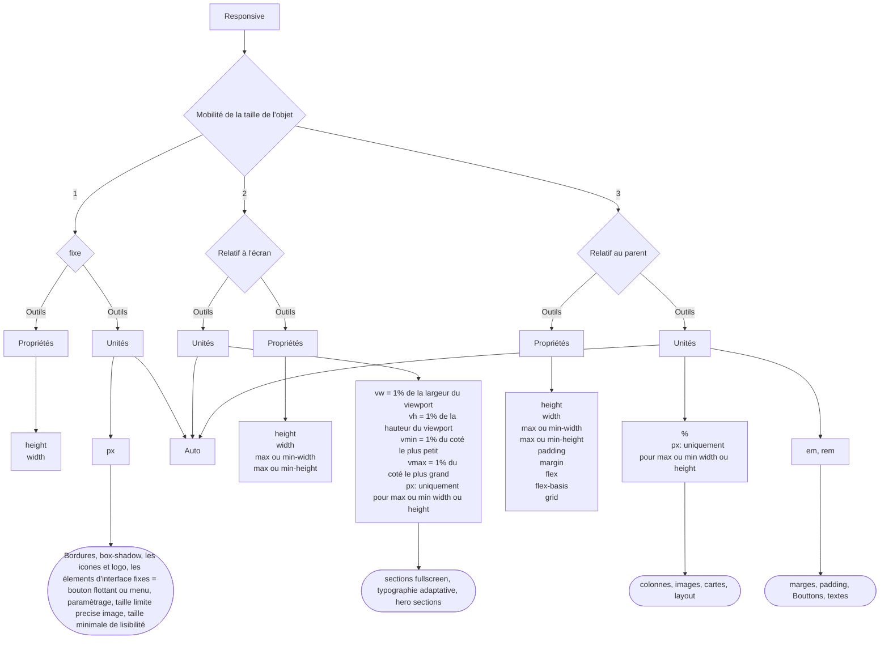

# Responsive

### La logique d'ajustement de la taille d'un element HTML:

```mermaid
---
config:
  layout: fixed
---
flowchart TB
    A["Responsive"] --> B@{ label: "Mobilité de la taille de l'objet" }
    B -- 1 --> C{"fixe"}
    B -- 2 --> D@{ label: "Relatif à l'écran" }
    B -- 3 --> E{"Relatif au parent"}
    C -- Outils --> F["Propriétés"] & G["Unités"]
    D -- Outils --> H["Propriétés"] & I["Unités"]
    E -- Outils --> J["Propriétés"] & K["Unités"]
    F --> FF["height
                width"]
    G --> GG["px"] & III["Auto"]
    H --> HH["height
                width
                max ou min-width
                max ou min-height"]
    I --> II["vw = 1% de la largeur du viewport
              vh = 1% de la hauteur du viewport
              vmin = 1% du coté le plus petit
              vmax = 1% du coté le plus grand
              px: uniquement pour max ou min width ou height"] & III
    J --> JJ["height
                width
                max ou min-width
                max ou min-height
                padding
                margin
                flex
                flex-basis
                grid"]
    K --> KK["%
             px: uniquement pour max ou min width ou height"] & KKK["em, rem"] & III
    KK --> usesKK(["colonnes, images, cartes, layout"])
    KKK --> usesKKK(["marges, padding, Bouttons, textes"])
    II --> usesII(["sections fullscreen, typographie adaptative, hero sections"])
    GG --> usesGG@{ label: "Bordures, box-shadow, les icones et logo, les élements d'interface fixes = bouton flottant ou menu, paramètrage, taille limite precise image, taille minimale de lisibilité" }

    B@{ shape: diamond}
    D@{ shape: diamond}
    usesGG@{ shape: stadium}

```
